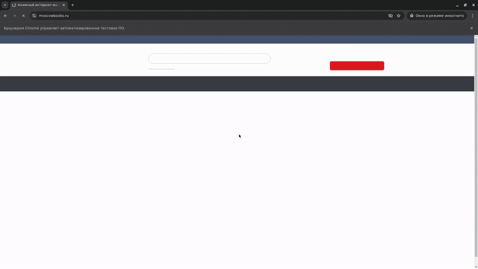

# Проект по автоматизации тестирования для книжного магазина [Moscow Books](https://www.moscowbooks.ru/)

> Moscow Books — один из ведущих магазинов по продаже книг.

## **Содержание:**
____

* <a href="#tools">Технологии и инструменты</a>

* <a href="#cases">Примеры автоматизированных тест-кейсов</a>

* <a href="#jenkins">Сборка в Jenkins</a>

* <a href="#console">Запуск из терминала</a>

* <a href="#allure">Allure отчет</a>

* <a href="#video">Примеры видео выполнения тестов на Selenoid</a>
____
<a id="tools"></a>
## Технологии и инструменты:

<p align="center">  
<a href="https://www.java.com/"></a>  
<a href="https://junit.org/junit5/"></a>  
<a href="https://maven.apache.org/"></a>  
<a href="https://www.selenium.dev/"></a>  
<a href="https://aerokube.com/selenoid/"></a>  
<a href="https://github.com/allure-framework/allure2"></a>    
<a href="https://www.jenkins.io/"></a>  
</p>

* Автотесты написаны на **Java**.
* В качестве билдера используется **Maven**.
* **JUnit 5** и **Selenium** - тестовые фреймворки.
* Для удаленного запуска реализована задача в **Jenkins** с генерацией отчета **Allure** и отправкой результата в **Telegram** через бота.

____
<a id="cases"></a>
**Примеры тест-кейсов:**</a>
____
- Вход пользователя
- Поиск по автору
- Проверка функционала избранного

____
<a id="jenkins"></a>
## Сборка в Jenkins
____
<p align="center">  
<a></a>  
</p>


### **Параметры сборки в Jenkins:**
- *browser (браузер, по умолчанию chrome)*


<a id="console"></a>
## Команды для запуска из терминала
___
***Локальный запуск:***

```bash  
mvn clean test
"-Dbrowser=${browser}"
```
___
<a id="allure"></a>
## Allure отчет
___

### Основная страница отчёта

<p align="center">  
  
</p>  

### Тест-кейсы

<p align="center">  
  
</p>

### Графики

<p align="center">  


  
</p>

____
<a id="video"></a>
## Пример видео выполнения тестов на Selenoid
____
<p align="center">
   
</p>